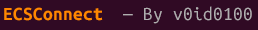
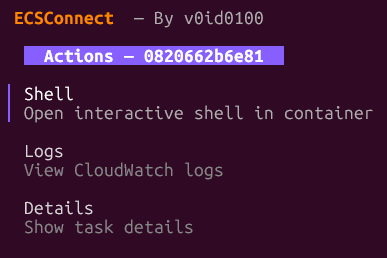
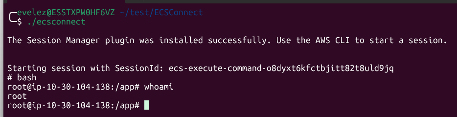

# ECSConnect



A terminal UI for navigating and interacting with AWS ECS clusters and tasks — built with Go and [Bubble Tea](https://github.com/charmbracelet/bubbletea).


---

## Just want the binary?

Download it: https://sourceforge.net/projects/ecsconnect/files/ecsconnect/download

Then check the hash: [Trustability](#trustability)


## Features

- **Browse** clusters and tasks across any AWS region
- **Shell** — open an interactive shell inside a running container via `aws ecs execute-command`
- **Logs** — stream the last 200 CloudWatch log events for any container
- **Details** — view task metadata: ARN, status, launch type, CPU/memory, started time, containers
- **Profile & region switching** — pick any AWS profile and region at startup or mid-session
- **Filter** — type `/` on any list to fuzzy-search clusters, tasks or containers
- **Go home** — jump back to profile selection from anywhere with `ctrl+g`





---

## Prerequisites

### 1. AWS CLI v2
```bash
aws --version   # must be 2.x
```
Install: https://docs.aws.amazon.com/cli/latest/userguide/getting-started-install.html

### 2. AWS credentials
```bash
aws configure          # default profile
aws configure --profile my-profile   # named profile
```
Profiles are read automatically from `~/.aws/config` and `~/.aws/credentials`.

### 3. Session Manager Plugin *(Shell feature only)*
```bash
session-manager-plugin --version
```
Install (Debian/Ubuntu):
```bash
curl "https://s3.amazonaws.com/session-manager-downloads/plugin/latest/ubuntu_64bit/session-manager-plugin.deb" -o /tmp/ssm.deb
sudo dpkg -i /tmp/ssm.deb
```

### 4. IAM permissions
Your AWS user or role needs at minimum:
```json
{
  "Action": [
    "ecs:ListClusters", "ecs:DescribeClusters",
    "ecs:ListTasks", "ecs:DescribeTasks",
    "ecs:DescribeTaskDefinition", "ecs:ExecuteCommand",
    "logs:GetLogEvents",
    "ssm:StartSession"
  ]
}
```

### 5. Enable Execute Command on your ECS service *(Shell feature only)*
```bash
aws ecs update-service \
  --cluster <cluster> \
  --service <service> \
  --enable-execute-command \
  --force-new-deployment
```

---

## Installation

```bash
git clone https://github.com/v0id0100/ECSConnect.git
cd ecsconnect
go build -o ecsconnect .
```

### Trustability:
Test it:
```bash
sha256sum ecsconnect
```

Hash sha256: `0c8187c19639f6232eda28e39154df3bf21f9080ba572f0980a0d4b15d81ed6e  ecsconnect`

---

## Usage

```bash
./ecsconnect
```

Navigate: **select a profile → region → cluster → task → action**.

---

## Keybindings

| Key | Action |
|-----|--------|
| `↑` / `↓` or `j` / `k` | Navigate list |
| `Enter` | Select |
| `/` | Filter current list |
| `Esc` | Go back (first press clears filter if active) |
| `ctrl+g` | Go home (back to profile selection) |
| `c` | Change region (from cluster or task list) |
| `r` | Refresh current list |
| `q` / `ctrl+c` | Quit |

---

## Logs

Errors and events are written to `~/.ecsconnect/ecsconnect.log`.

```bash
tail -f ~/.ecsconnect/ecsconnect.log
```

---

## Built with

| Library | Purpose |
|---------|---------|
| [Bubble Tea](https://github.com/charmbracelet/bubbletea) | TUI framework |
| [Bubbles](https://github.com/charmbracelet/bubbles) | List, viewport, spinner components |
| [Lip Gloss](https://github.com/charmbracelet/lipgloss) | Styles and colours |
| [AWS SDK for Go v2](https://github.com/aws/aws-sdk-go-v2) | ECS and CloudWatch Logs API |

---

*By v0id0100*
